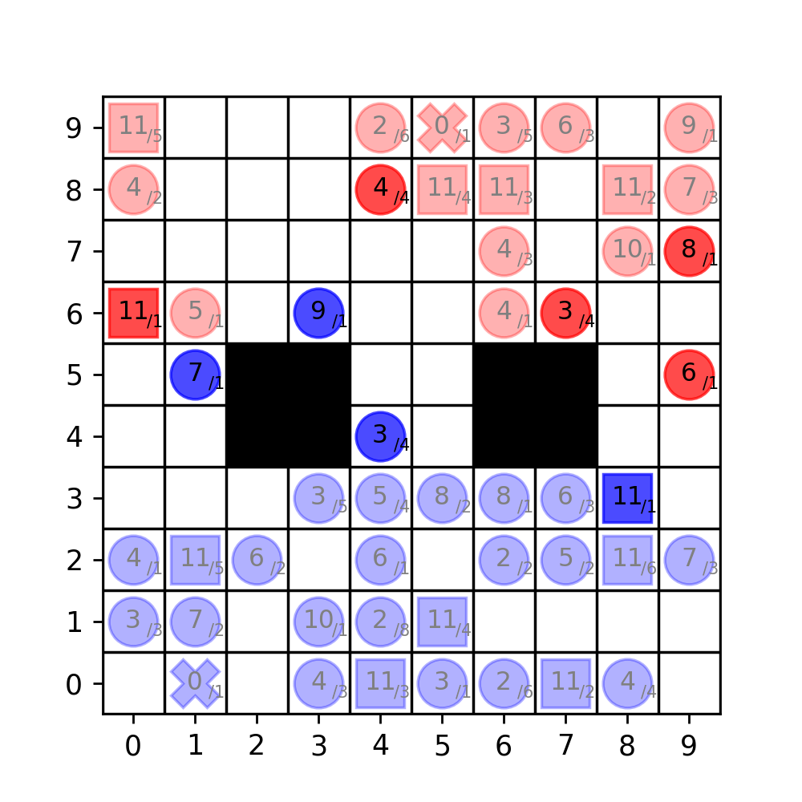

# Stratego AI environment

This package allows to build and train reinforcement learning agents on the board game Stratego.

There are all 3 size versions of the game implemented: 
- Small (5x5)
- Medium (7x7)
- Large/Normal (10x10).

More information soon...

